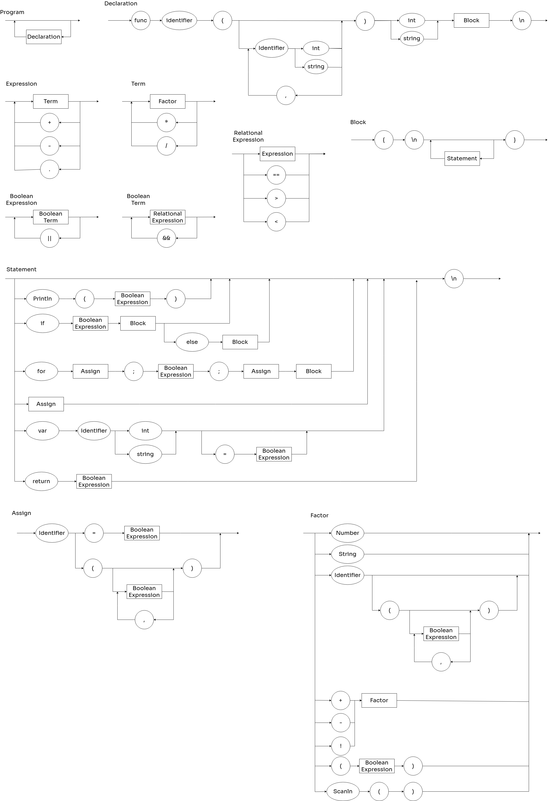

# GoLang Compiler by Renato Laffranchi Falcão

Welcome to my GoLang compiler repository! This project was developed under the guidance of Professor Raul Ikeda during the "Lógica da Computação" course at Insper. It encapsulates intricate principles of the theory of computation and compiler design, presenting a comprehensive journey into the world of GoLang compiler creation.

## Sprint Tracker


## Syntactic Diagram



## EBNF

```
PROGRAM = { STATEMENT } ;
BLOCK = "{", "\n", { STATEMENT }, "}" ;
STATEMENT = ( λ | ASSIGN | PRINT | IF | FOR | VAR), "\n" ;
ASSIGN = IDENTIFIER, "=", BOOLEAN EXPRESSION ;
PRINT = "Println", "(", BOOLEAN EXPRESSION, ")" ;
IF = "if", BOOLEAN EXPRESSION, BLOCK, { "else", BLOCK } ;
FOR = "for", ASSIGN, ";", BOOLEAN EXPRESSION, ";", ASSIGN, BLOCK ;
VAR = "var", IDENTIFIER, ( "int" | "string" ), ( λ | "=", BOOLEAN EXPRESSION ) ;
BOOLEAN EXPRESSION = BOOLEAN TERM, { "||" BOOLEAN TERM } ;
BOOLEAN TERM = RELATIONAL EXPRESSION, { "&&", RELATIONAL EXPRESSION } ;
RELATIONAL EXPRESSION = EXPRESSION, { ("==" | ">" | "<"), EXPRESSION } ;
EXPRESSION = TERM, { ("+" | "-" | "." ), TERM } ;
TERM = FACTOR, { ("*" | "/"), FACTOR } ;
FACTOR = NUMBER | STRING | IDENTIFIER | (("+" | "-" | "!"), FACTOR) | "(", BOOLEAN EXPRESSION, ")" | SCAN ;
SCAN = "Scanln", "(", ")" ;
IDENTIFIER = LETTER, { LETTER | DIGIT | "_" } ;
NUMBER = DIGIT, { DIGIT } ;
STRING = ( `"` | `'` ), { λ | LETTER | DIGIT }, ( `"` | `'` ) ;
LETTER = ( a | ... | z | A | ... | Z ) ;
DIGIT = ( 1 | 2 | 3 | 4 | 5 | 6 | 7 | 8 | 9 | 0 ) ;
```

## GDB Debbuging

### Compiling in debug mode
```
python3 main.py file.go
nasm -f elf -F dwarf -o program.o program.asm
gcc -m32 -no-pie -g -o program program.o
```

### GDB Commands

```
gdb ./program
(gdb) b line_number -> sets a breakpoint @ line number
(gdb) run -> run complete program, unless there is a breakpoint
(gdb) step or stepi -> run line by line of code 
```

## References

IME-USP. (1999). [The Netwide Assembler: NASM](https://www.ime.usp.br/~reverbel/mac211-99/asm/nasm_doc/nasmdoca.html).